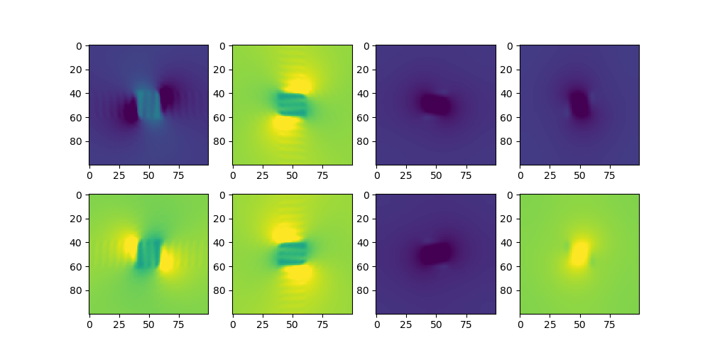
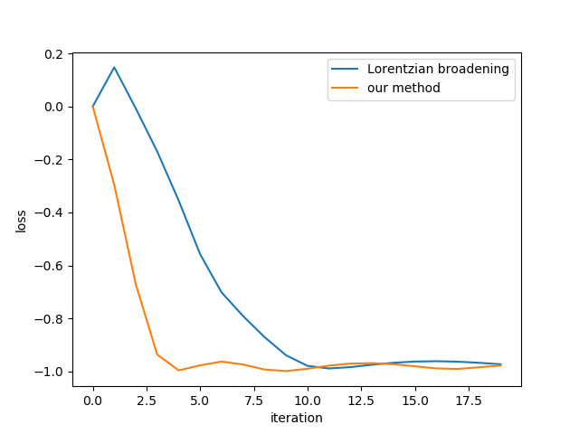

# diffsmat_py

PyTorch demo of differentiable rigorous coupled wave analysis (RCWA) in

Ziwei Zhu, and Changxi Zheng. [Differentiable Scattering Matrix for Optimization of Photonic Structures](https://opg.optica.org/oe/fulltext.cfm?uri=oe-28-25-37773). Optics Express 28.25 (2020).

For a more complete implementation, please check our official C++ version [link](https://github.com/Columbia-Computational-X-Lab/DiffSMat)

The library only depends on numpy and PyTorch, although drawing figures requires the installation of matplotlib. You can easily install these libraries via:

`pip install numpy torch matplotlib`

The above simple installation may be not ideal on some platforms, so we suggest you to take a look at:

[PyTorch Installation Guide](https://pytorch.org/get-started/locally/)

## Feature

* stable and fast differentiable rcwa
* no relaxation needed for repeated eigenvalues
* fast fourier factorization (fast convergence for small number of harmonics)
* analytical Fourier transform (converge for low-resolution grid)
* topological optimization
* level set optimization
* support for more geometries (coming soon)
* new algorithms for PIC design (coming soon)

## Gallery

### Optical mode analysis

permittivity distribution            |  mode Ex, Ey, Hx, Hy
:-------------------------:|:-------------------------:
  |  

### Topological optimization

designed permittivity          |  loss curve
:-------------------------:|:-------------------------:
  |  

### Level set optimization

designed permittivity          |  loss curve
:-------------------------:|:-------------------------:
  |  